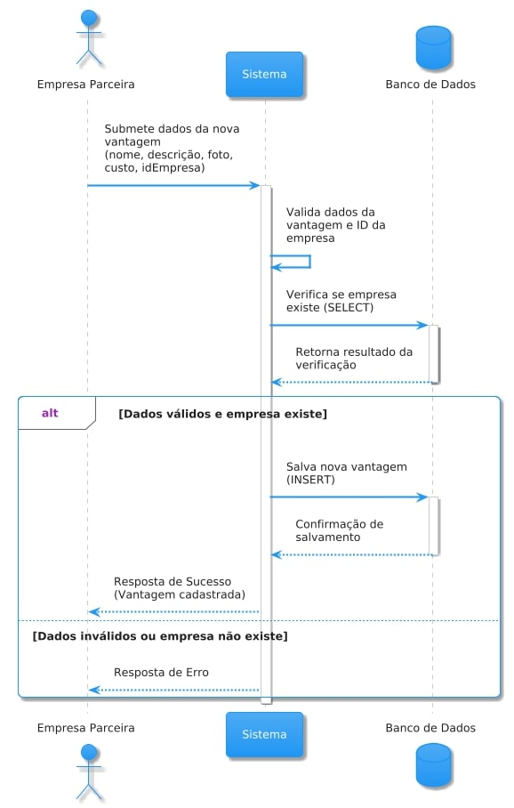
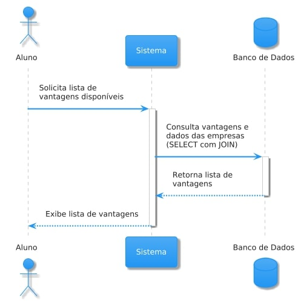
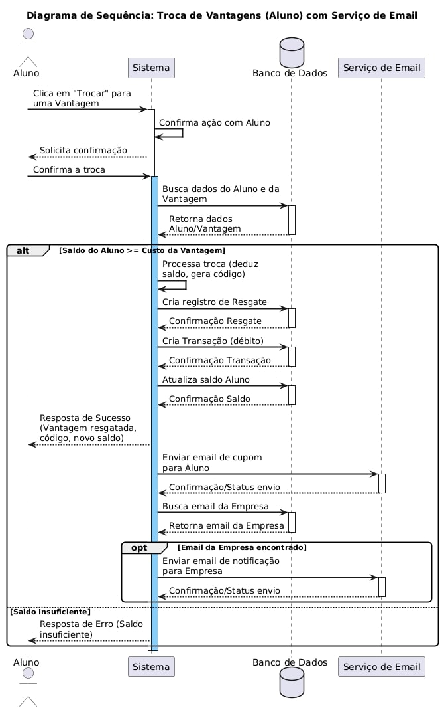

# Sistema de Moeda Estudantil 🪙

Este projeto visa desenvolver um sistema de moeda estudantil que permita o reconhecimento e recompensa de alunos por meio de uma moeda virtual. Alunos podem acumular moedas e trocá-las por vantagens oferecidas por empresas parceiras. Professores podem distribuir moedas aos alunos como forma de reconhecimento.

## Histórias de Usuário

- 👤 Como usuário, eu quero realizar login no sistema para acessar as funcionalidades.

- 👤 Como aluno, quero me cadastrar no sistema com meus dados pessoais e acadêmicos para participar do programa de mérito estudantil.

- 👤 Como aluno, quero selecionar a minha instituição de ensino no momento do cadastro para validar minha participação.

- 👤 Como aluno, quero receber notificações por email ao ganhar moedas para saber que fui reconhecido.

- 👤 Como aluno, quero consultar meu extrato de transações para acompanhar quantas moedas recebi e como utilizei.

- 👤 Como aluno, quero trocar moedas por vantagens cadastradas no sistema para usufruir dos benefícios oferecidos.

- 👤 Como aluno, quero receber um email com um cupom e código ao trocar moedas para poder apresentar no local de uso.

- 👤 Como professor, quero consultar meu saldo de moedas para saber quantas ainda posso distribuir.

- 👤 Como professor, quero distribuir moedas para alunos com uma mensagem de reconhecimento para premiar comportamentos positivos.

- 👤 Como professor, quero visualizar meu extrato para acompanhar a distribuição de moedas realizadas.

- 👤 Como professor, quero que meu saldo de moedas acumule a cada semestre para não perder moedas não utilizadas.

- 👤 Como empresa parceira, quero me cadastrar no sistema com meus dados e login para poder oferecer vantagens aos alunos.

- 👤 Como empresa parceira, quero cadastrar vantagens com nome, descrição, foto e custo em moedas para atrair alunos.

- 👤 Como empresa parceira, quero receber um email com um código sempre que um aluno resgatar uma vantagem para validar a troca.

## Diagramas do Sistema 📊

Abaixo estão os diagramas que representam a arquitetura e o fluxo do sistema:

### Diagrama de Caso de Uso

### Diagrama de Classes

### Diagrama de Componentes

### Modelo Entidade-Relacionamento

### Diagramas de Sequência

**Cadastro de Vantagens:**

**Distribuição de Moedas:**

**Resgate de Vantagens:**
